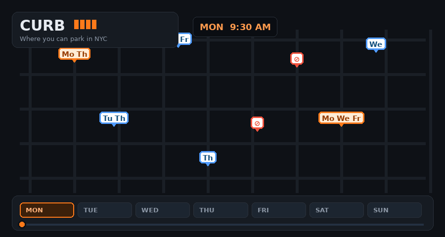

# 🅿️ Curb — where you can park in NYC

**Curb** shows where you can legally park in New York City and warns you when to move
for street cleaning. It turns NYC's raw parking-sign data (~88,000 curb segments citywide)
into a live, time-aware map — with a signage-style view, a "no cleaning on these days"
filter, and a magnifier for reading dense blocks on a phone.

### ▶️ Live demo: **https://nycityparking.netlify.app/**



> The GIF above is a stylized preview. Replace it with a real screen recording any time —
> save it as `docs/demo.gif`.

---

## ✨ Features

- **Time-aware status** — scrub through the week and watch every curb change color:
  free · free but time-limited · metered · no parking now · street cleaning.
- **Signs view** — small sign icons drawn on the correct side of the street, with
  two-letter cleaning days (`Tu Th`) and a red ⊘ for no-standing/parking anytime.
  Click any sign for the full breakdown of that block.
- **Cleaning filter** — pick the days you want to park; the map keeps only streets with
  **no cleaning** on those days (each sign still shows the days it *is* cleaned), and keeps
  the red "never park" warnings.
- **Magnifier** — an open/close, drag-and-resize loupe for reading dense blocks on mobile.
- **Street-cleaning countdown** — "next cleaning in 3h 20m" per block.
- **Hydrant awareness** — flags curb within 15 ft of a fire hydrant.
- **Day / Night** basemap and collapsible panels so the map stays usable on a phone.
- **Auto-updating** — the server re-downloads NYC data every 24h (configurable).

---

## 🧠 How it works

```
NYC Open Data ──▶ ingest ──▶ parse signs ──▶ enrich (geo + hydrants) ──▶ blockfaces
                                                                              │
                                          Flask API  ◀── status_at(time) ─────┤
                                                │                             │
                                          MapLibre UI                   static build
                                          (live mode)                   (Netlify mode)
```

1. **Ingest** (`nyc_parking/ingest.py`) pulls two NYC Open Data datasets via the Socrata
   API: *Parking Regulation Locations and Signs* (`nfid-uabd`) and *NYCDEP Citywide
   Hydrants* (`6pui-xhxz`).
2. **Parse** (`nyc_parking/regulations.py`) converts each sign's free text
   (e.g. `NO PARKING (SANITATION BROOM SYMBOL) MONDAY THURSDAY 9AM-10:30AM`) into
   structured rules: category, days, time window, street-cleaning flag.
3. **Enrich** (`nyc_parking/enrich.py`) projects NY State Plane coordinates (EPSG:2263) to
   lat/lon, computes hydrant distance in feet, and groups signs into **blockfaces**
   (a curb segment between two cross-streets, one side).
4. **Serve** (`app.py`) exposes a small API and computes the governing status for any
   moment (most-restrictive active rule wins). The **same page** also runs a JavaScript
   port of that engine, so it works with no backend on Netlify.

The web app runs in two modes automatically:

| Mode | When | Data |
|---|---|---|
| **Live** | `python app.py` (Flask) | computed per request, auto-refreshed |
| **Static** | Netlify / no backend | precomputed file + in-browser engine |

---

## 📁 Project structure

```
curb/
├── app.py                     # Flask server: API + background auto-loader + auto-refresh
├── build_static.py            # builds ./dist for Netlify (static, no backend)
├── check_api.py               # diagnoses NYC Open Data access / credentials
├── make_sample.py             # generates the bundled Brooklyn sample dataset
├── demo_offline.py            # runs the pipeline logic on a fixture (no network)
├── netlify.toml               # Netlify config (publish = dist)
├── requirements.txt
│
├── nyc_parking/               # the data pipeline (pure Python, tested)
│   ├── config.py              # ← put your NYC Open Data token / API key here
│   ├── ingest.py              # Socrata download (auth, paging, retries)
│   ├── regulations.py         # sign-text parser + status engine
│   ├── enrich.py              # projection, hydrant join, blockface grouping
│   └── pipeline.py            # orchestrates ingest → enrich → output
│
├── templates/
│   └── index.html             # the whole front end (MapLibre map + UI + JS engine)
├── static/vendor/             # MapLibre GL JS/CSS (bundled, no CDN needed)
├── data/
│   └── sample/                # small Brooklyn sample so it runs out of the box
├── docs/
│   ├── demo.gif               # README demo
│   └── make_demo_gif.py       # regenerates the demo GIF
└── tests/
    └── test_regulations.py    # parser + status unit tests
```

---

## 🚀 Run it locally

```bash
pip install -r requirements.txt
python app.py
# open http://127.0.0.1:5000
```

On launch it auto-downloads real NYC data in the background (Brooklyn first, then the rest),
showing progress on the map. Until it lands you'll see a bundled Brooklyn sample.

**Optional token** — NYC data works anonymously but is faster with a free credential.
Put it in `nyc_parking/config.py`:

```python
NYC_APP_TOKEN = ""                 # classic App Token, OR
NYC_API_KEY_ID = ""                # newer API Key needs BOTH id
NYC_API_KEY_SECRET = ""            # and secret
```
Get one at <https://data.cityofnewyork.us/profile/edit/developer_settings>. If a credential
is ever rejected, Curb automatically continues anonymously. Verify with `python check_api.py`.

Run the tests with `python -m tests.test_regulations`.

---

## ☁️ Deploy to Netlify

The live app is Flask, which Netlify doesn't run — so we ship a **static** build that
computes status in the browser:

```bash
python -m nyc_parking.pipeline --borough Brooklyn   # 1) get data
python build_static.py                              # 2) writes ./dist
npx netlify-cli deploy --dir=dist --prod            # 3) deploy (or drag ./dist to app.netlify.com/drop)
```

A static site is a snapshot — re-run the build and redeploy to refresh it. Citywide data is
large, so a single borough keeps the static site light. **Live at
[nycityparking.netlify.app](https://nycityparking.netlify.app/).**

---

## 🗺️ Data & credits

- Parking rules: [NYC DOT — Parking Regulation Locations and Signs](https://data.cityofnewyork.us/Transportation/Parking-Regulation-Locations-and-Signs/nfid-uabd)
- Hydrants: [NYCDEP Citywide Hydrants](https://data.cityofnewyork.us/Environment/NYCDEP-Citywide-Hydrants/6pui-xhxz)
- Map rendering: [MapLibre GL JS](https://maplibre.org/) · basemap tiles © OpenStreetMap © CARTO

## ⚠️ Notes & roadmap

- Each block is shown at one point; splitting a blockface into exact curb spans using the
  sign **arrows** is the next milestone.
- Sign location approximates the curb point (good hydrant flag, not survey-grade).
- **No real-time occupancy** — whether a specific spot has a car in it is not in any dataset
  and can't come from satellite imagery.

## 📝 License

MIT — see `LICENSE` (add one if you haven't yet). Data belongs to the City of New York.
